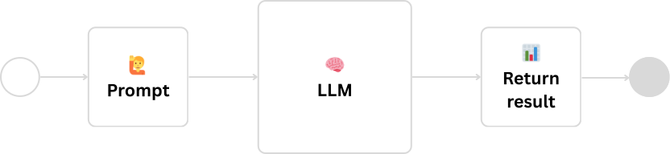
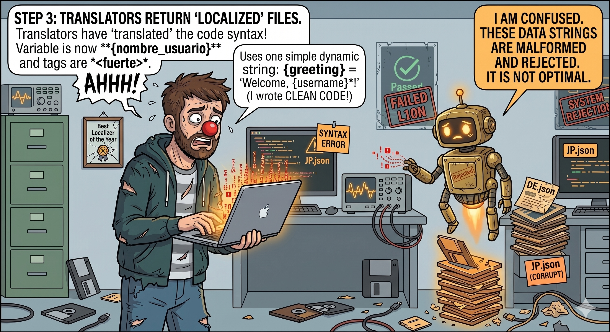
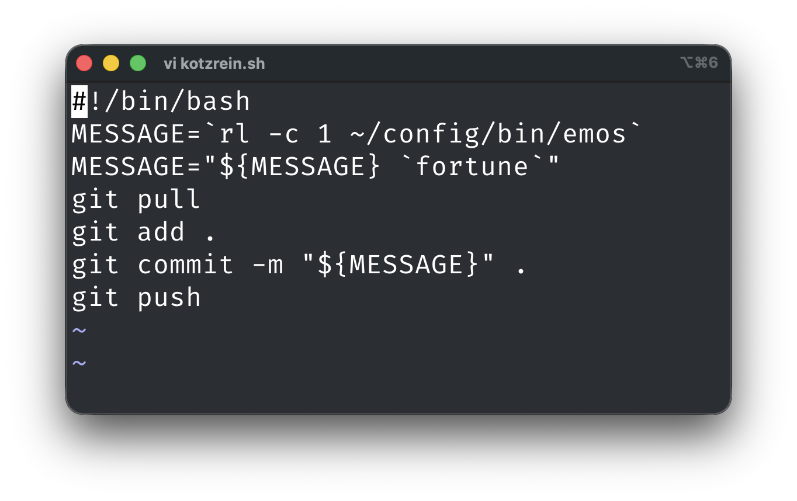
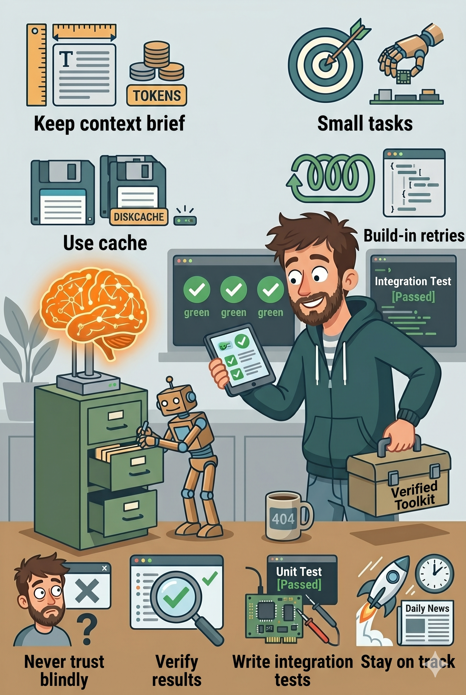

# LLMs, KI-Agenten und RAG
### Praxisbeispiele aus dem Entwickleralltag

  
    David Übelacker
  

---

# 👨‍💻 Wer bin ich?

- **David �belacker**
- Software Architect @ nag informatik ag in Basel
- 20+ Jahre Erfahrung in der Web- und Mobile-App-Entwicklung

  

    
    

    

      
      
uebelacker.dev

    

  

---
layout: two-cols-header
---

# KI ändert unseren Job

::left::

Diese zwei Dinge müssen wir machen:

### 1. Mit KI arbeiten 🛠️

Wir müssen **dranbleiben** und lernen, mit den neuen KI-Tools zu arbeiten – um produktiver zu werden und die Qualität unserer Arbeit zu steigern.

### 2. KI bauen 🚀

Wir müssen lernen, **selbst KI-Applikationen zu entwickeln** – um bereit zu sein, wenn Prozesse im Unternehmen mithilfe von KI automatisiert und verbessert werden sollen.

::right::

---
layout: two-cols-header
---

::left::

# Heutige Themen

## Theorie

* 🧠 Was sind LLMs, KI-Agenten
* 🗄️ Retrieval-Augmented Generation (RAG)
* ☁️ Cloud vs. lokale Modelle

## Beispiele

* 🗼 Lokalisierung automatisieren
* 💬 Git Commit-Messages generieren
* 📬 Mail-Support mit RAG automatisieren

::right::

---

# Was ist ein LLM?

Ein Large Language Model (LLM) ist eine Art von künstlicher Intelligenz, die darauf ausgelegt ist, menschenähnlichen Text zu verstehen, vorherzusagen und zu generieren.

  

---

# 🗼 Lokalisierung automatisieren

  

---

# Was ist ein KI-Agent?

Ein KI-Agent ist ein System, das ein Ziel bekommt und mithilfe eines Large Language Models (LLM) und Tools selbst entscheidet, welche Schritte nötig sind – und so lange iteriert, bis es erreicht ist.

---
layout: two-cols-header
---

# 💬 Git Commit-Messages generieren

::left::

::right::

---

# Was ist RAG?

RAG (Retrieval-Augmented Generation) ist eine KI-Technik, mit der sich die Ausgabe eines LLM durch gezielte Informationen optimieren lässt, ohne das zugrunde liegende Modell selbst anzupassen.

  

---

# 📬 Mail-Support mit RAG automatisieren

---

# 💡 Finale Tipps

 

🤷 **Vertraue keinem LLM**
 das LLM macht nicht, was Du willst

* 🎯 **Kleine Tasks**
 ein Prompt, ein klares Ziel

* 🗄️ **Prompts einzeln testbar machen**
 Cache und Integrations Tests beim entwickeln

* 🔁 **Retries**
  bei Structured Output

* 🚀 **Dranbleiben** 
  das KI Umfeld ändert sich täglich

---
layout: fact
---

# Vielen Dank!
 

https://github.com/uebelack/llm-real-world-examples

