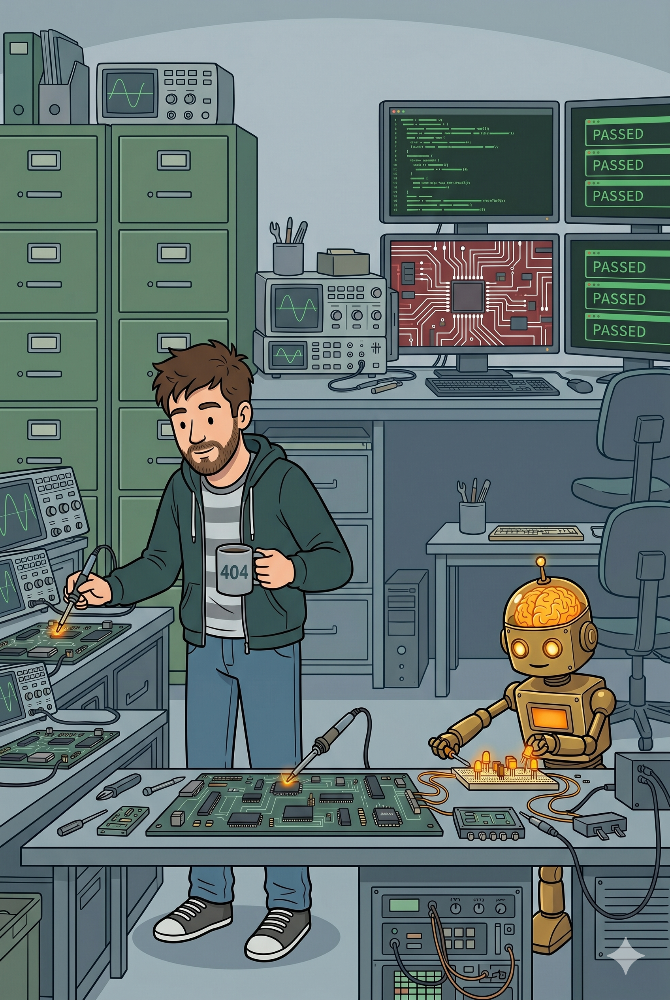
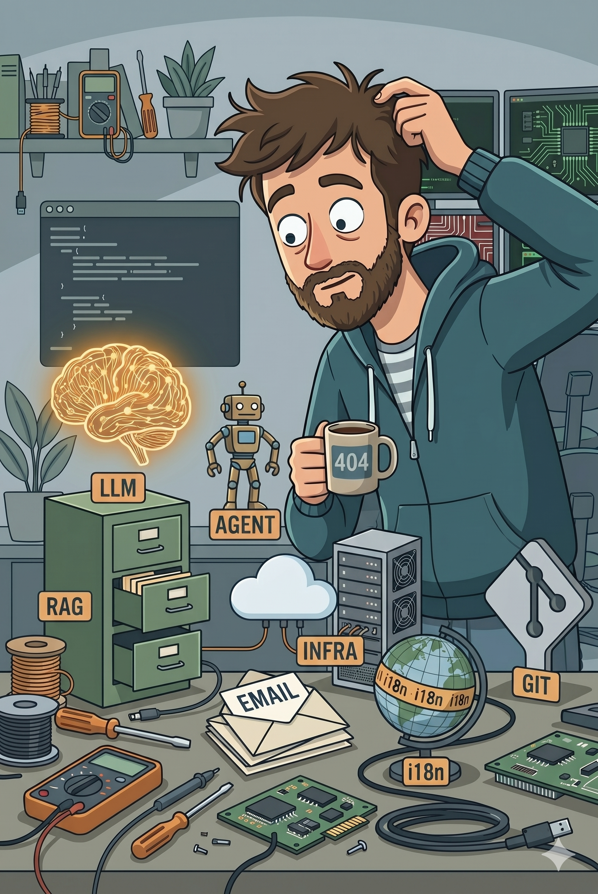
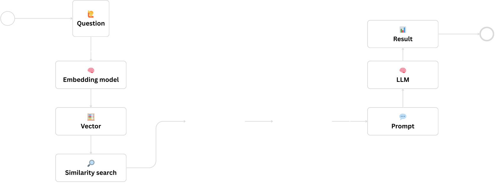
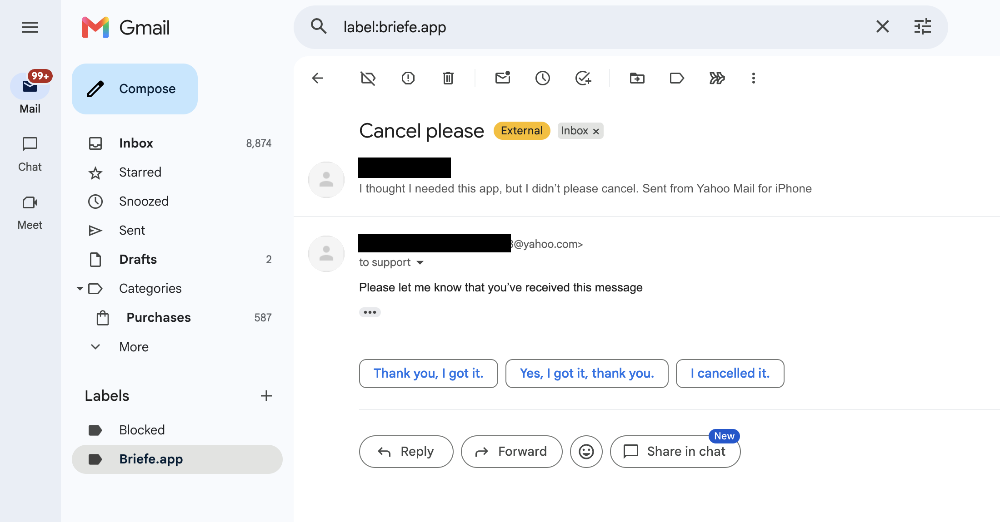

# LLMs, AI Agents and RAG
### Real-World Examples from a Developer’s Daily Work

  
    David Übelacker
  

---

# 👨‍💻 Who am I?

- **David �belacker**
- Software Architect @ nag informatik ag in Basel
- 20+ years of experience in web and mobile application development

  

    
    

    

      
      
uebelacker.dev

    

  

---
layout: two-cols-header
---

# AI is changing our job

We need to do these two things:

::left::

## 1. Working with AI 🛠️

We need to **stay on top of things** and learn to work with the new AI tools — to become more productive and improve the quality of our work.

## 2. Building with AI 🚀

We need to learn to **develop AI applications ourselves** — to be ready when processes in the company are to be automated and improved with the help of AI.

::right::

---
layout: two-cols-header
---

::left::

# Today’s Topics

## Theory

* 🧠 What are LLMs, AI Agents and RAG?
* ☁️ Cloud vs. local models

## Examples

* 🗼 Automate localization
* 💬 Generate git commit messages
* 📬 Automate mail support with RAG

::right::

---

# What is an LLM?

A Large Language Model (LLM) is a type of artificial intelligence designed to understand, predict, and generate human-like text.

  

---

# 🗼 Automate localization

---

# What is an AI Agent?

An AI agent is a system that takes a goal, uses a large language model (LLM) and tools, and iterates until the goal is achieved.

---
layout: two-cols-header
---

# 💬 Generate git commit messages

::left::

::right::

---

# What is RAG ?

RAG, or Retrieval-Augmented Generation, is an AI technique that combines a large language model's ability to generate text with an external knowledge base, such as a database or set of documents, to produce more accurate and relevant answers.

---

# 📬 Automate mail support with RAG

---

# 💡 Final Tips

 

🤷 **Don't trust any LLM**
 the LLM doesn't do what you want

* 🎯 **Small tasks**
 one prompt, one clear goal

* 🗄️ **Make prompts individually testable**
 cache during development, integration tests

* 🔁 **Retries**
  for structured output

* 🚀 **Keep at it**
  the field moves daily

---
layout: fact
---

# Thank you!
 

https://github.com/uebelack/llm-real-world-examples