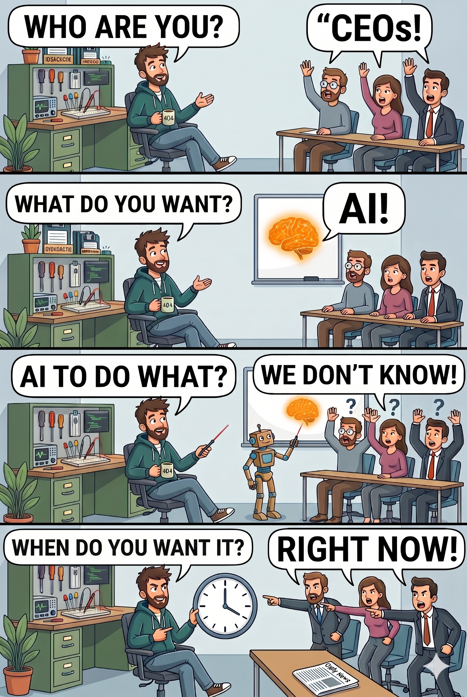
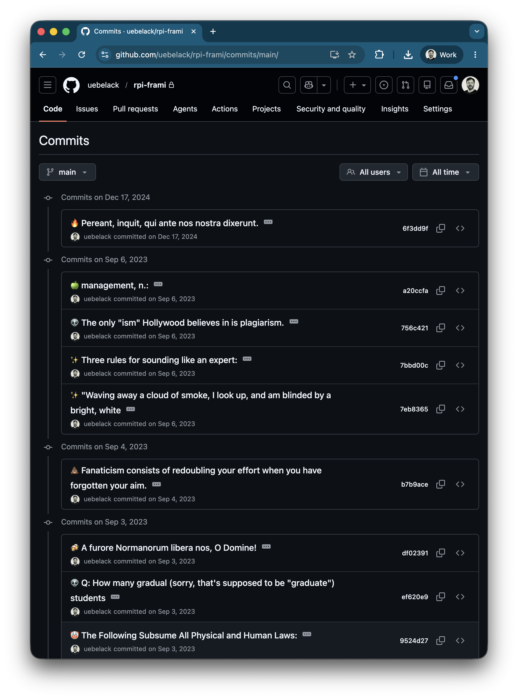

# LLMs, KI-Agenten und RAG
### Praxisbeispiele aus dem Entwickleralltag

<div class="absolute bottom-10">
  <span class="font-700">
    David Übelacker
  </span>
</div>

---

# 👨‍💻 Wer bin ich?

- **David �belacker**
- Software Architect @ nag informatik ag in Basel
- 20+ Jahre Erfahrung in der Web- und Mobile-App-Entwicklung

<div class="absolute bottom-10">
  <div class="flex items-end">
    
    <div style="width:45%"></div>
    <div style="width: 30%; display: flex; flex-direction: column; align-items: center;">
      
      <div>uebelacker.dev</div>
    </div>
  </div>
</div>

---
layout: two-cols-header
---

# KI ändert unseren Job

<br/>

Diese zwei Dinge müssen wir machen:

::left::

### 1. Mit KI arbeiten 🛠️

Wir müssen **dranbleiben** und lernen, mit den neuen KI-Tools zu arbeiten – um produktiver zu werden und die Qualität unserer Arbeit zu steigern.

::right::

### 2. KI bauen 🚀

Wir müssen lernen, **selbst KI-Applikationen zu entwickeln** – um bereit zu sein, wenn Prozesse im Unternehmen mithilfe von KI automatisiert und verbessert werden sollen.

---
layout: two-cols-header
---

::left::

# Was können wir mit LLM's machen?

<div style="height: 3px;"/>

🧐 **Text** (Bild/Video/Sprache) **analysieren**
✍️ **Text** (Bild/Video/Sprache) **generieren**

<div style="height: 3px;"/>

### Beispiele
<div style="height: 10px;"/>

* Kundenkontakt vereinfachen (Tickets, Antworten, Übersetzung)
* Wissen erschliessen (RAG, semantische Suche, Meeting-Notizen)
* Prozesse automatisieren (Dokumente extrahieren, Entscheide vorbereiten)
* Inhalte & Daten generieren (Reports, Texte, Bilder)


::right::



---
layout: two-cols-header
---

::left::

# Heutige Themen

<div style="padding-top: 20px;"></div>

## Theorie

<div class="emoji-list" style="padding-top: 10px; padding-bottom: 30px;">

* 🧠 Was sind LLMs, KI-Agenten
* 🗄️ Retrieval-Augmented Generation (RAG)
* ☁️ Cloud vs. lokale Modelle

</div>

## Beispiele

<div class="emoji-list" style="padding-top: 10px;">

* 🗼 Lokalisierung automatisieren
* 💬 Git Commit-Messages generieren
* 📬 Mail-Support mit RAG automatisieren

</div>

::right::


---

# Was ist ein LLM?

Ein Large Language Model (LLM) ist eine Art von künstlicher Intelligenz, die darauf ausgelegt ist, menschenähnlichen Text zu verstehen, vorherzusagen und zu generieren.

<div class="center">
  
</div>

---

# 🗼 Lokalisierung automatisieren


---
layout: two-cols-header
---

# Frameworks

Open-Source-Frameworks für die Abstraktion von LLMs/APIs und die Entwicklung von KI-Agenten.

<br/>

::left::

### 🦜 LangChain
* 🐍 Python, 🟨 JavaScript/TypeScript, ☕ Java (LangChain4j)
* https://langchain.com/

<br/>

### ▲ Vercel AI SDK
* TypeScript-first, Streaming & Structured Output via Zod
* https://ai-sdk.dev/

::right::

### 🤖 Agent Development Kit
* Neues Framework von Google
* 🐍 Python, 🔷 TypeScript, 🐹 Go, ☕ Java
* https://adk.dev/

<br/>

### ⚡ mastra
* TypeScript-first, vom Team hinter Gatsby (YC W25)
* Baut auf dem Vercel AI SDK auf
* https://mastra.ai/

---
layout: two-cols-header
---

# Lokale Large Language Models

::left::

## ✅ Vorteile
* Datenschutz
* Geringe Kosten
* Unabhängigkeit
* Kein Internet

## 😭 Nachteile
* Langsamer
* Mehr Halluzinationen
* Unzuverlässiger
* Hardwarekosten

::right::

## 🛠️ Tools
* https://ollama.com/
* https://lmstudio.ai/
* https://llama.cpp/

## 🧠 Modelle
* Llama (Meta)
* Qwen (Alibaba)
* DeepSeek
* Mistral
* Gemma (Google)
* Phi (Microsoft)

---
layout: two-cols-header
---

# 💡 TIPP: Keep it short

**Je kleiner und präziser die Aufgabe, desto besser das Ergebnis.**

::left::

### ❌ Vermeiden

```text
"Schreib mir eine komplette Web-App mit Login, Dashboard 
und REST-API"
```

🫠 Zu viel auf einmal

- 🎯 LLM verliert den Fokus
- 🧊 Ergebnis ist oberflächlich
- 🔧 Schwer zu korrigieren

::right::

### ✅ Besser: Aufgabe aufteilen

```text
1. „Entwirf das Datenmodell für User + Rollen"
2. „Erstelle den Login-Endpoint mit JWT"
3. „Baue die Dashboard-Komponente"
```

🎯 Ein Task = ein klares Ziel

- ✨ Ergebnis ist fokussiert und präzise
- 🐛 Fehler sind sofort erkennbar
- 🔄 Iteratives Arbeiten möglich

::bottom::

> 🧠 **Kleine Tasks → mehr Kontrolle → bessere Ergebnisse**

---

# Was ist ein KI-Agent?

Ein KI-Agent ist ein System, das ein Ziel bekommt und mithilfe eines Large Language Models (LLM) und Tools selbst entscheidet, welche Schritte nötig sind – und so lange iteriert, bis es erreicht ist.


---
layout: two-cols-header
---

# 💬 Git Commit-Messages generieren

::left::


::right::



---
layout: two-cols-header
---

# LLM Observability

Was zur Hölle macht mein KI-Agent?

<br/>

::left::

### LangSmith · Kommerziell 
 
- Sprachen: Python, JS/TS, Java
- [smith.langchain.com](https://smith.langchain.com)

<br/>

### Langfuse · Open Source
  
- Sprachen: Python, JS/TS, Java*, OTLP
- [langfuse.com](https://langfuse.com)

<br/>

### Helicone · Open Source
 
- Sprachen: Alle (Proxy), Python, JS/TS
- [helicone.ai](https://helicone.ai)


::right::


---
layout: two-cols-header
---

# 💡 TIPP: Prompts isoliert testbar machen

Prompt-Engineering ist Experimentieren. Je schneller du einen einzelnen Prompt ausführen und bewerten kannst, desto schneller wird er gut. Ohne Testbarkeit debuggst du blind.

::left::
### 🗄️ Cache in der Entwicklung
Gleicher Input → gleiche Response, kein API-Call. Spart Zeit & Tokens, macht Runs deterministisch.

::right::
### 🎯 Prompt Integration Tests 
Pro Prompt ein isolierter integration Test der mit dem Prompt das LLM aufruft.

::bottom::


---

# Was ist RAG?

RAG, oder Retrieval-Augmented Generation, ist eine KI-Technik, die die Fähigkeit eines Large Language Models zur Textgenerierung mit einer externen Wissensbasis, wie einer Datenbank oder einem Dokumentenset, kombiniert, um genauere und relevantere Antworten zu erzeugen.


---

# 📬 Mail-Support mit RAG automatisieren


---

# Fazit

<br/>

<div class="emoji-list">

* 📏 **Kontext kurz halten** – jedes Token zählt
* 🎯 **Kleine Tasks** – ein Prompt, ein klares Ziel
* 🗄️ **Cache nutzen** – z.B. `diskcache` in der Entwicklung
* 🔁 **Retries einbauen** – speziell bei Structured Output

</div>

<br/>

<div class="emoji-list">

* 🤷 **Vertraue nie blind** – LLM's machen nicht was du sagst
* 🔍 **Ergebnisse verifizieren** – kontrolliere die Daten!
* 🧪 **Integration Tests schreiben** – sonst debuggst du blind
* 🚀 **Dranbleiben** – das Feld bewegt sich täglich

</div>


---
layout: fact
---

# Vielen Dank!
<br/>

<div class="center">

</div>

https://github.com/uebelack/llm-real-world-examples

