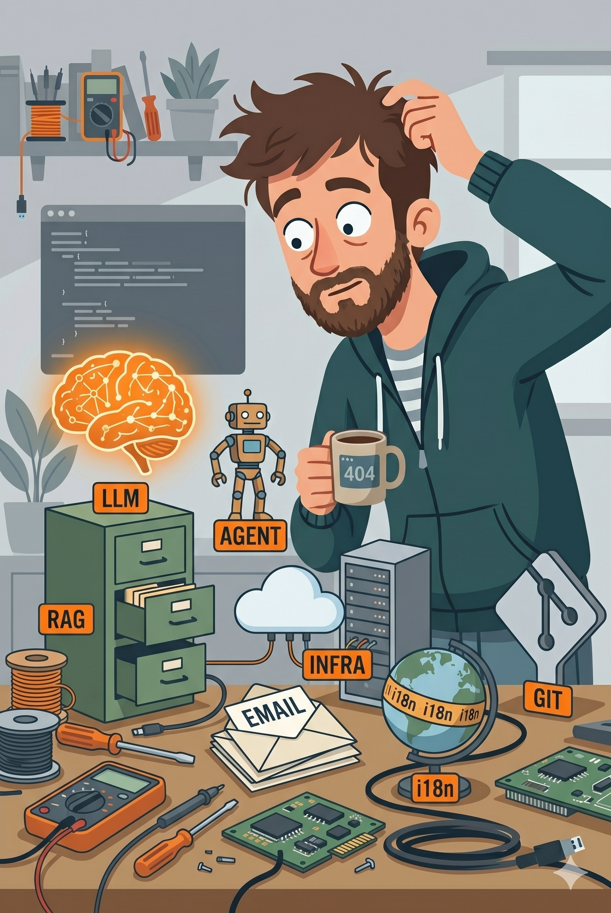
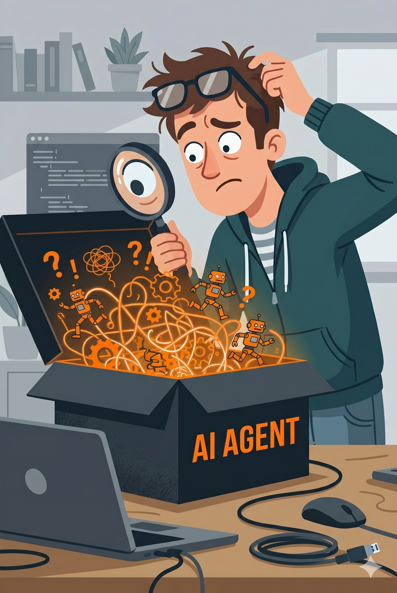
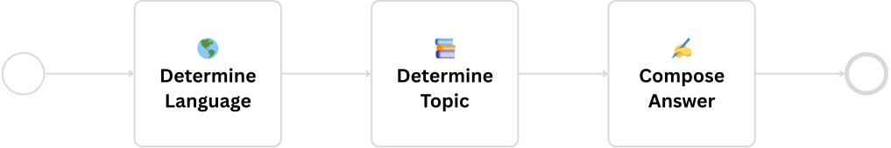

# LLMs, AI Agents and RAG
### Real-World Examples from a Developer’s Daily Work

<div class="absolute bottom-10">
  <span class="font-700">
    David Übelacker
  </span>
</div>

---

# 👨‍💻 Who am I?

- **David �belacker**
- Software Architect @ nag informatik ag in Basel
- 20+ years of experience in web and mobile application development

<div class="absolute bottom-10">
  <div class="flex items-end">
    
    <div style="width:45%"></div>
    <div style="width: 30%; display: flex; flex-direction: column; align-items: center;">
      
      <div>uebelacker.dev</div>
    </div>
  </div>
</div>

---

<div class="newspaper">
  <div class="newspaper-rule-thick"></div>
  <div class="newspaper-articles">
    <div class="newspaper-article">
      <div class="newspaper-date">September 2025</div>
      <div class="newspaper-headline">Salesforce lays off 4,000 employees and replaces them with AI agents</div>
    </div>
    <div class="newspaper-divider"></div>
    <div class="newspaper-article">
      <div class="newspaper-date">January 2026</div>
      <div class="newspaper-headline">Anthropic CEO predicts: AI models will replace software developers in 6–12 months</div>
    </div>
    <div class="newspaper-divider"></div>
    <div class="newspaper-article">
      <div class="newspaper-date">March 2026</div>
      <div class="newspaper-headline">Atlassian cuts one in ten employees due to AI</div>
    </div>
  </div>
  <div class="newspaper-rule-thick"></div>
</div>

---

<div class="newspaper">
  <div class="newspaper-rule-thick"></div>
  <div class="newspaper-articles">
    <div class="newspaper-article">
      <div class="newspaper-date">March 2026</div>
      <div class="newspaper-headline">OpenAI plans to nearly double its workforce by 2026</div>
    </div>
  </div>
  <div class="newspaper-rule-thick"></div>
</div>


---
layout: two-cols-header
---

# Our job is changing

<br/>
Two things we need to do right now:

::left::

## 1. Working with AI 🛠️

We need to **stay on top of things** and learn to work with the new AI tools — to become more productive and improve the quality of our work.

::right::

## 2. Building with AI 🚀

We need to learn to **develop AI applications ourselves** — to be ready when processes in the company are to be automated and improved with the help of AI.


---
layout: two-cols-header
---

::left::

# Today’s Topics

<div style="padding-top: 20px;"></div>

## Theory

<div class="emoji-list" style="padding-top: 10px; padding-bottom: 30px;">

* 🧠 What are LLMs, AI Agents and RAG?
* ☁️ Cloud vs. local models

</div>

## Examples

<div class="emoji-list" style="padding-top: 10px;">

* 💬 Generate Git commit messages
* 🗼 Finally automate localization
* 📬 Automate mail support with RAG

</div>

::right::



---

# What is an LLM?

A Large Language Model (LLM) is a type of artificial intelligence designed to understand, predict, and generate human-like text.

<div class="center">
  
</div>

---
layout: two-cols-header
---

# Frameworks

Open-source frameworks for abstracting LLMs/APIs and developing AI agents.

<br/>

::left::

### 🦜 LangChain
* 🐍 Python, 🟨 JavaScript/TypeScript, ☕ Java (LangChain4j)
* https://langchain.com/

<br/>

### ▲ Vercel AI SDK
* TypeScript-first, streaming & structured output via Zod
* https://ai-sdk.dev/

::right::

### 🤖 Agent Development Kit
* New framework from Google
* 🐍 Python, 🔷 TypeScript, 🐹 Go, ☕ Java
* https://adk.dev/

<br/>

### ⚡ mastra
* TypeScript-first, by the team behind Gatsby (YC W25)
* Built on top of the Vercel AI SDK
* https://mastra.ai/

---
layout: two-cols-header
---

# 💡 TIP: Keep it short

**The smaller and more precise the task, the better the result.**

<br/>

::left::

### ❌ Avoid

```text
"Write me a complete web app with login, dashboard 
and REST API"
```

🫠 Too much at once

- 🎯 LLM loses focus
- 🧊 Result is superficial
- 🔧 Hard to correct

::right::

### ✅ Better: Split the task

```text
1. "Design the data model for users + roles"
2. "Create the login endpoint with JWT"
3. "Build the dashboard component"
```

🎯 One task = one clear goal

- ✨ Result is focused and precise
- 🐛 Errors are immediately visible
- 🔄 Iterative work is possible

::bottom::

> 🧠 **Small tasks → more control → better results**

---
layout: two-cols-header
---

# Local Large Language Models #1

::left::

## ✅ Advantages
* Privacy
* Low cost
* Independence
* No internet required

## 😭 Disadvantages
* Slower
* More hallucinations
* Less reliable
* Hardware costs

::right::

## 🛠️ Tools
* https://ollama.com/
* https://lmstudio.ai/
* https://github.com/ggml-org/llama.cpp

## 🧠 Models
* Llama (Meta)
* Qwen (Alibaba)
* DeepSeek
* Mistral
* Gemma (Google)
* Phi (Microsoft)

---

# Hardware Requirements for Q4 Models

| Model Size | Model Memory | Mac (Unified Memory) | Intel/x86 (RAM + GPU VRAM)       |
|------------|--------------|----------------------|----------------------------------|
| 8B         | ~5 GB        | 16 GB                | 16 GB RAM + 8–12 GB VRAM         |
| 13B        | ~8 GB        | 24 GB                | 16 GB RAM + 12 GB VRAM           |
| 34B        | ~20 GB       | 36–48 GB             | 32 GB RAM + 24 GB VRAM (RTX 4090)|
| 70B        | ~40 GB       | 64 GB                | 64 GB RAM + 2× 24 GB VRAM        |

**8B, 13B, 32B, 70B**: B = Billion parameters — the number of learned weights in the model.

**Q2, Q4, Q6, FP16**: Q2/Q4/Q6 indicate quantization with 2/4/6 bits per parameter; FP16 is the unquantized original using 16-bit floating-point numbers.

---

# What is an AI Agent?

An AI agent is a system that takes a goal, uses a large language model (LLM) and tools, and iterates until the goal is achieved.


---
layout: two-cols-header
---

# LLM Observability

What the hell is my AI agent doing?

<br/>

::left::

### LangSmith · Commercial
 
- Languages: Python, JS/TS, Java
- [smith.langchain.com](https://smith.langchain.com)

<br/>

### Langfuse · Open Source
  
- Languages: Python, JS/TS, Java*, OTLP
- [langfuse.com](https://langfuse.com)

<br/>

### Helicone · Open Source
 
- Languages: All (Proxy), Python, JS/TS
- [helicone.ai](https://helicone.ai)


::right::



---

# What is RAG ?

RAG, or Retrieval-Augmented Generation, is an AI technique that combines a large language model's ability to generate text with an external knowledge base, such as a database or set of documents, to produce more accurate and relevant answers.


---
layout: two-cols-header
---

# 💡 TIP: Make prompts testable in isolation

Prompt engineering is experimentation. The faster you can run and evaluate a single prompt, the faster it gets good. Without testability, you're debugging blind.

::left::
### 🗄️ Cache during development
Same input → same response, no API call. Saves time & tokens, makes runs deterministic.

::right::
### 🎯 Prompt integration tests
One isolated integration test per prompt that calls the LLM with that prompt.

::bottom::



---
layout: fact
---

# Thank you!
